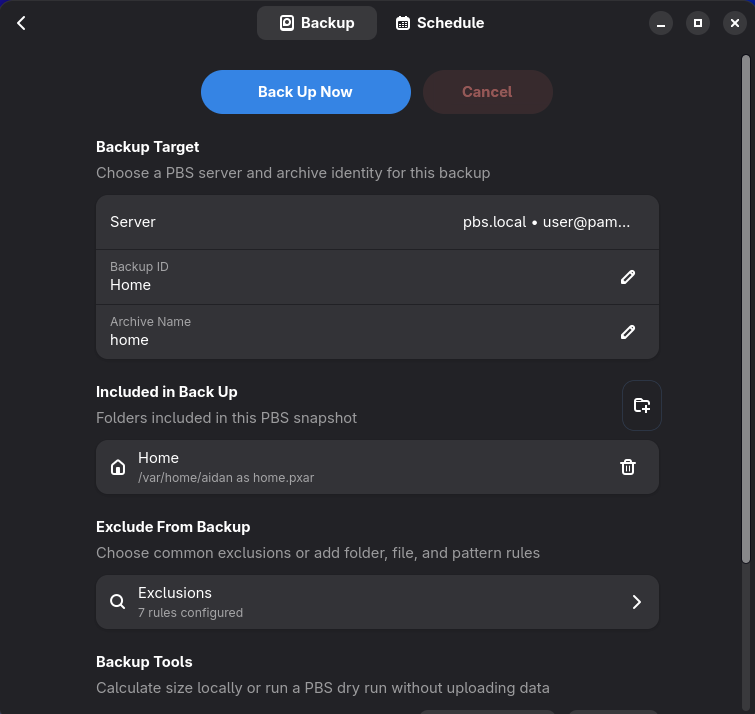

# Crumbs

Crumbs is a Proxmox Backup Server client for GNOME desktops. It is
intended for immutable Linux desktops where the OS can be
replaced or rolled and you just need to be selective about backing up user data.



## Installation

You can install it by first adding this repo:

```bash
flatpak remote-add --user networkoctopus https://networkoctopus.github.io/flatpak/networkoctopus.flatpakrepo
```
then search for it in GNOME software.

or install manually:

```bash
flatpak install --user networkoctopus io.github.networkoctopus.Crumbs
```

## Development

Test the core without GTK:

```bash
cargo test --no-default-features
```

Run the app on a system with GTK4 and libadwaita development packages:

```bash
cargo run
```

The Flatpak manifest builds both Crumbs and Proxmox Backup Client from pinned
source revisions. The GitHub Actions workflow builds native `x86_64` and
`aarch64` variants from the same manifest and combines them into one Flatpak
repository. The development manifest temporarily permits Cargo network access.

The provisional application ID is `io.github.networkoctopus.Crumbs`. No
project licence has been selected yet.

## Licensing

Crumbs builds and bundles `proxmox-backup-client` as a separate executable in
the Flatpak. That component is distributed under the GNU Affero General Public
License version 3 by Proxmox. See
[THIRD_PARTY_NOTICES.md](THIRD_PARTY_NOTICES.md) for pinned source revisions,
the build patch, and license notices.

